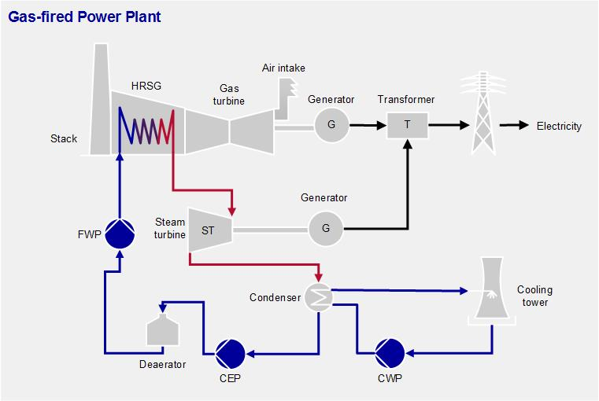
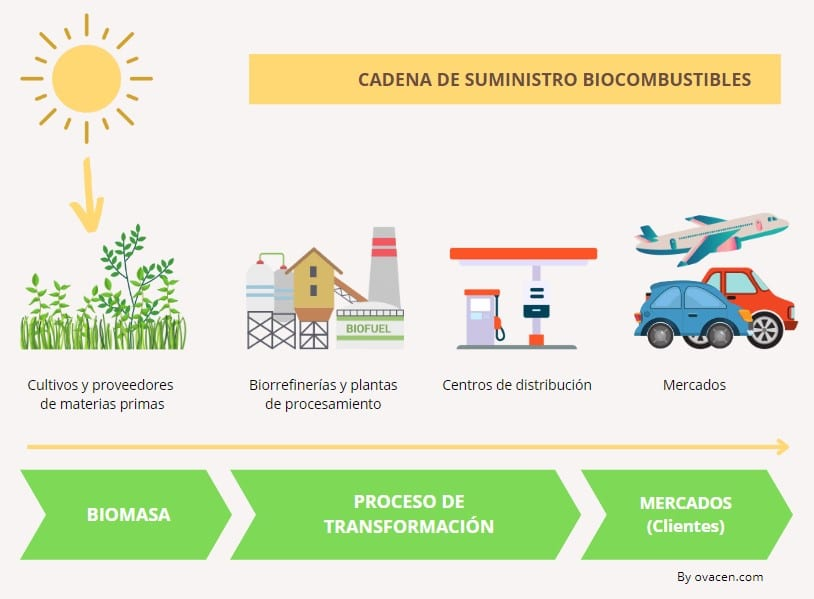
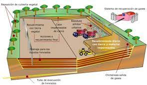
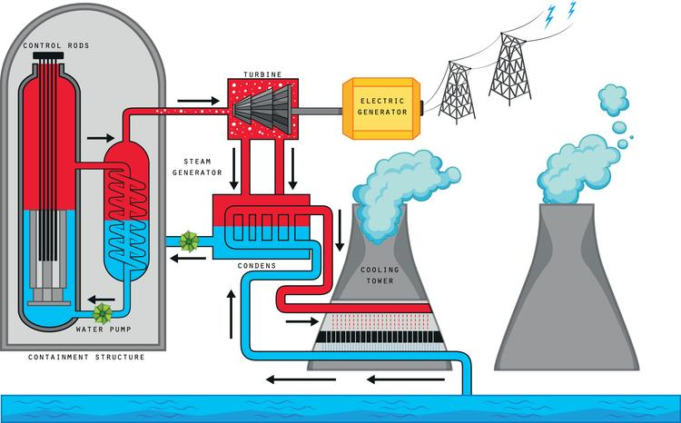
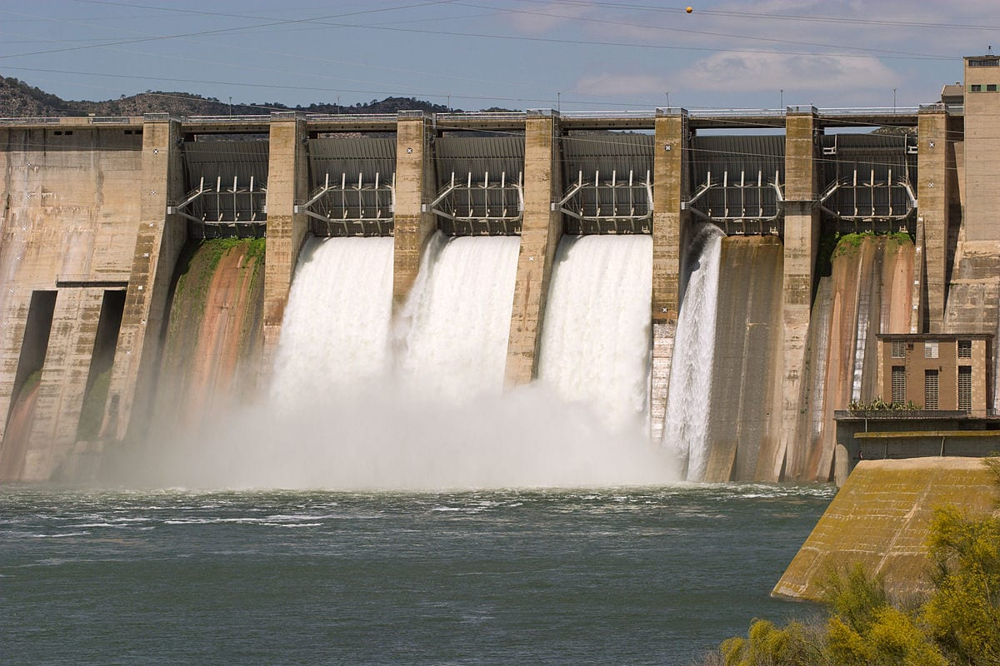
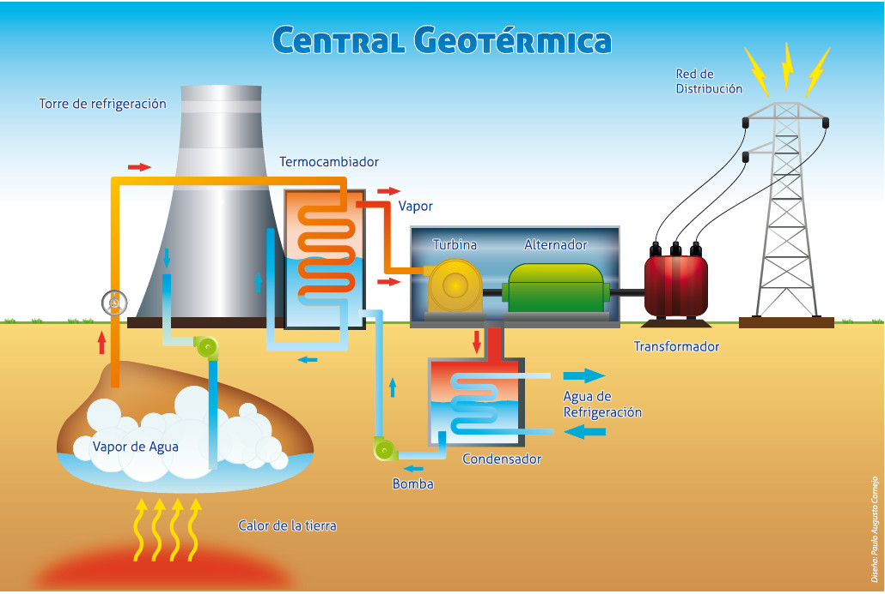
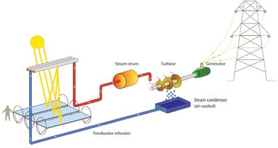
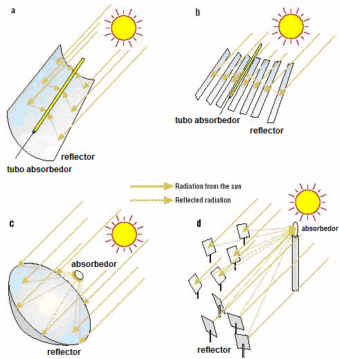
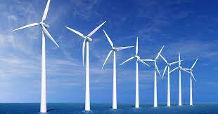
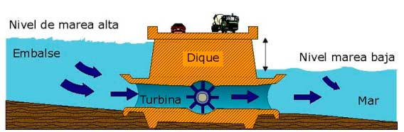

__Incluir:__ una explicación de la diferencia entre relaciones entre variables y relaciones entre individuos.

## Temas a tratar

- Introducción al análisis estadístico multivariado

- Distancias en el análisis estadístico multivariado

- Distancias con variables cualitativas

- Distancias con variables cuantitativas

- Conclusiones Generales 

## Analisis estadistico multivariado

El análisis estadístico multivariado es una técnica que permite analizar conjuntos de datos que involucran múltiples variables, estudiando cómo se relacionan entre sí y cómo afectan conjuntamente a un resultado o variable de interés mediante el uso de diversas técnicas estadísticas.


## Distancias en el análisis estadístico multivariado

- En el análisis estadístico multivariado, se trabaja con múltiples variables.
- Las distancias son una medida de la similitud o diferencia entre los objetos (individuos, variables, etc.) en función de estas variables.
- Son ampliamente utilizadas en análisis de datos, clusterización, clasificación, entre otros.
- En esta presentación, nos enfocaremos en algunas de las distancias más utilizadas en el análisis estadístico multivariado.

## Selección de la medida de distancia en análisis estadístico multivariado

- La elección de la medida de distancia adecuada depende del objetivo del análisis.
- Depende del tipo de datos y de la escala de medida de las variables.
- La elección también puede depender de la estructura de los datos (por ejemplo, si hay datos faltantes o valores extremos).
- Es importante tener en cuenta las propiedades de las medidas de distancia, como la simetría, la triangularidad y la identidad de los indiscernibles.


## Selección de la medida de distancia en análisis estadístico multivariado

- Si el objetivo es encontrar grupos de objetos similares, se pueden utilizar medidas de distancia que enfaticen la similitud, como la distancia euclidiana.
- Si el objetivo es clasificar objetos en diferentes categorías, se pueden utilizar medidas de distancia que minimicen la variabilidad dentro de cada categoría, como la distancia de Mahalanobis.
- Si el objetivo es determinar la estructura subyacente de los datos, se pueden utilizar medidas de distancia que revelen patrones de covariación entre las variables, como la distancia de correlación.
- Si el objetivo es identificar objetos anómalos o extremos, se pueden utilizar medidas de distancia robustas, como la distancia de Minkowski con un valor de p mayor que 1.


## Medidas de distancia entre individuos

- La elección de la medida de distancia entre individuos puede depender de la escala de medida de las variables y del tipo de variables. 
- Si las variables están en diferentes escalas, la distancia euclidiana no será adecuada ya que una variable con una escala más grande tendrá una mayor influencia en la medida de distancia.
- Si las variables son de tipo categórico o nominal, la distancia euclidiana no se puede utilizar y se deben usar medidas de distancia apropiadas para variables categóricas, como la distancia de Gower.
- Si las variables son de tipo ordinal, la distancia euclidiana no es la mejor medida y se pueden utilizar medidas de distancia apropiadas para variables ordinales, como la distancia de Spearman.
- Si las variables son de tipo binario, se puede utilizar la distancia de Hamming.
- Si las variables son mixtas (numéricas y categóricas), se pueden utilizar medidas de distancia apropiadas para datos mixtos, como la distancia de Gower.

- Si las variables están en diferentes escalas, se pueden utilizar medidas de distancia que tengan en cuenta la variabilidad y la escala de cada variable, como la distancia de Mahalanobis.

## Medidas de distancia entre variables

- La elección de la medida de distancia entre variables también puede depender de la escala de medida y del tipo de variables. 


## Distancias con variables cualitativas
En el análisis multivariado de variables cualitativas, la distancia se refiere a la medida de la diferencia entre dos observaciones o individuos en función de sus características o variables cualitativas. 
Existen diferentes medidas de distancia que se pueden utilizar en el análisis multivariado de variables cualitativas. Algunas de las más comunes son:

- Distancia Hamming

- Distancia Jaccard


## Distancia Hamming

La distancia de Hamming es una medida de la distancia entre dos cadenas de igual longitud. La fórmula para calcular la distancia de Hamming es la siguiente:

$$ D_H(x, y) = \sum_{i=1}^{n} \mathbb{I}(x_i \neq y_i) $$
Donde $x$ y $y$ son las cadenas que se van a comparar, $n$ es la longitud de las cadenas y $\mathbb{I}(x_i \neq y_i)$ es una función indicadora que devuelve 1 si los caracteres en las posiciones $i$ de $x$ y $y$ son diferentes y 0 en caso contrario.

## Ejemplo

Supongamos que tenemos dos cadenas binarias de la misma longitud,
x = "0110101" e y = "1100110". Queremos calcular la distancia de Hamming entre estas dos cadenas.

Para ello, podemos utilizar la fórmula anterior, 

$$D_H(x, y) = \sum_{i=1}^7 \mathbb{I}(x_i \neq y_i)$$

$$D_H(x, y) = \mathbb{I}(0 \neq 1) + \mathbb{I}(1 \neq 1) + \mathbb{I}(1 \neq 0) + \mathbb{I}(0 \neq 0) + \mathbb{I}(1 \neq 0) + \mathbb{I}(0 \neq 1) + \mathbb{I}(1 \neq 0)$$

$$D_H(x, y) = 1 + 0 + 1 + 0 + 1 + 1 + 1$$

Por lo tanto, la distancia de Hamming entre las cadenas binarias x e y es de 5. Esto significa que hay 5 posiciones en las que las cadenas difieren.


## Distancia Jaccard

Se utiliza para medir la similitud entre dos conjuntos de variables cualitativas. 

La distancia de Jaccard entre dos conjuntos $A$ y $B$ se define como:

$$ d_J(A,B) = 1 - \frac{|A \cap B|}{|A \cup B|} $$

Donde $|A|$ representa el tamaño del conjunto $A$ y $A \cap B$ y $A \cup B$ representan la intersección y la unión de los conjuntos $A$ y $B$, respectivamente. Esta fórmula mide la distancia entre dos conjuntos basándose en la similitud entre ellos.

## Ejemplo 

A continuación, se presenta una tabla que contiene información acerca de los clientes y los productos adquiridos. En dicha tabla, se representa con el número 0 cuando el cliente no ha comprado el producto y con el número 1 cuando sí lo ha adquirido.


## Ejemplo 

Con base en los datos recolectados previamente, se realiza el cálculo de la distancia Jaccard entre cada cliente, con el fin de identificar patrones y tendencias en su comportamiento y asi tener una tomar decisiones más precisas e informadas. El resultado de este cálculo se producirá en una matriz de distancias, que sintetizará de manera efectiva los resultados obtenidos.


## Conclusiones

- Los clientes cuyas distancias son más cercanas a 0 tienen un alto grado de similitud en sus compras. tal es el caso de los clientes A y B, C y D que presentan una distancia de 0,33 lo que indica que tienen patrones de compra similares. 

- Los clientes que tienen una distancia de 0,50 como los clientes B y D, tienen una afinidad del 50% en sus compras. Esto significa que dividen la mitad de los productos que compran.

-  Los clientes cuyas distancias son más cercanas a 1 tienen un alto grado de disimilitud en sus compras, como lo son, los clientes A y D, asi como los clientes B y C que presentan una distancia de 0,75 Esta medida indica que estos clientes presentan la mayor disimilitud entre todos los datos analizados en cuanto a sus patrones de compra. 

## Distancias con variables cuantitativas

En análisis multivariado, se utilizan diferentes métodos para medir la distancia entre observaciones con variables cuantitativas. Estas medidas de distancia son utilizadas en técnicas como análisis de componentes principales, análisis de correspondencias, análisis de conglomerados, entre otras.

A continuación, se describen algunas de las medidas de distancia más comunes en análisis multivariado con variables cuantitativas:

- Distancia Euclidiana

- Distancia Manhattan

- Distancia Mahalanobis


## Distancia Euclidiana

La distancia euclidiana es una medida de la distancia entre dos puntos en un espacio euclidiano de dos o más dimensiones.

La distancia euclidiana entre dos puntos $p$ y $q$ en un espacio euclidiano de $n$ dimensiones se define como:

$$ d_E(p,q) = \sqrt{\sum_{i=1}^{n} (p_i - q_i)^2} $$

Donde $p_i$ y $q_i$ son las coordenadas del punto $p$ y el punto $q$ en la $i$-ésima dimensión, respectivamente.

## Ejemplo 
Supongamos que tenemos dos vectores P y Q:

$p = (1, 2, 3)$ y $q = (4, 5, 6)$, entonces la distancia euclidiana entre $p$ y $q$ es:

$$ d_E(p,q) = \sqrt{(1-4)^2 + (2-5)^2 + (3-6)^2} = \sqrt{27} \approx 5.196 $$

## Distancia Manhattan

La distancia de Manhattan es una medida de distancia entre dos puntos en un espacio euclidiano de n dimensiones, mide la distancia que hay que recorrer para ir de un punto a otro si sólo se permiten movimientos en línea recta horizontal o vertical.La fórmula para calcular la distancia de Manhattan es la siguiente:

$$ D_M(x, y) = \sum_{i=1}^{n} |x_i - y_i| $$

Donde $x$ y $y$ son los vectores que se van a comparar, $n$ es el número de dimensiones y $|x_i - y_i|$ representa la diferencia absoluta entre la coordenada $i$ de $x$ y la coordenada $i$ de $y$.

## Ejemplo

Supongamos que tenemos dos vectores X y Y:

$x = (1, 2, 3)$ y $y = (4, 5, 6)$, entonces la distancia Manhattan entre $x$ y $y$ es:

$$ D_M(x) = |1 - 4| + |2 - 5| + |3 - 6| = 9 $$

## Distancia Mahalanobis

La distancia de Mahalanobis es una medida de la distancia entre un punto y un conjunto de puntos, teniendo en cuenta la covarianza entre las variables. La fórmula para calcular la distancia de Mahalanobis es la siguiente:

$$ D_M(x) = \sqrt{(x - \mu)^T \Sigma^{-1} (x - \mu)} $$

Donde $x$ es el vector de variables, $\mu$ es el vector de medias y $\Sigma$ es la matriz de covarianza.

Donde $p_i$ y $q_i$ son las coordenadas del punto $p$ y el punto $q$ en la $i$-ésima dimensión, respectivamente.

## Ejemplo

En el siguiente ejemplo se utiliza la distancia de Mahalanobis para detectar valores atípicos en un conjunto de datos simulado de características de televisores. lo que puede ayudar a detectar problemas en la producción o a tomar decisiones de marketing y precios más informadas.


```
##   resolucion_pantalla consumo_energia precio distancia_maha
## 1                1593              57    700       3.068845
## 2                1110             197   1500       2.806825
## 3                1846             217   1000       2.725497
## 4                1139             170   3000       2.543593
## 5                1856              80    500       1.464287
## 6                1529             219   1200       1.401068
```
## Conclusiones

Al analizar detalladamente la tabla anterior, podemos concluir que aquellos dispositivos tecnológicos que se encuentran significativamente alejados de la media podrían estar experimentando problemas relacionados con sus características. Por el contrario, aquellos dispositivos que se encuentran en posiciones más cercanas a la media sugieren una mayor estabilidad en sus características. 

Por consiguiente, los fabricantes de dispositivos electrónicos deben considerar cuidadosamente estos resultados al diseñar y promocionar sus productos, con el fin de optimizar su posicionamiento en el mercado y ofrecer el mejor valor a sus clientes.

## Diagrama de dispersion 

A continuación, se presenta un gráfico que permite una mejor visualización de la relación entre las variables, lo que facilita la identificación de patrones y tendencias en los datos.

<!-- --> 


## Conclusiones

- Resolución de pantalla y precio: se puede observar una relación positiva entre la resolución de pantalla y el precio de los televisores. Esto sugiere que los televisores con una resolución de pantalla más alta tienden a tener un precio más alto.

- Consumo de energía y precio: se puede observar una relación negativa entre el consumo de energía y el precio de los televisores. Esto sugiere que los televisores que consumen menos energía tienden a tener un precio más alto.

- Distancia entre los puntos: la distancia entre los puntos en la gráfica indica la similitud en las características de los televisores. Por ejemplo, los televisores con una resolución de pantalla similar y un consumo de energía similar tienden a estar más cerca de unos de otros.

- Dos grupos claros: se puede observar que hay dos grupos claros de televisores en la gráfica: uno con una resolución de pantalla alta y un consumo de energía bajo, y otro con una resolución de pantalla más baja y un consumo de energía más alto.

## Tabla

A continuacion, se presenta una tabla sintetizada que resume las distancias y sus respectivos tipos, es decir, si aplica para variables cualitativo o cuantitativo


```
## # A tibble: 2 x 6
##   Tipos        Hamming Jaccard Euclidiana Manhattan Mahalanobis
##   <chr>        <chr>   <chr>   <chr>      <chr>     <chr>      
## 1 Cualitativo  "OK"    "OK"    ""         ""        ""         
## 2 Cuantitativo ""      ""      "OK"       "OK"      "OK"
```

## Conclusiones Generales

En el análisis multivariado, el uso de medidas de distancia como la Hamming, Jaccard, Euclidiana, Manhatan y Mahalanobis es esencial para comprender la estructura de los datos y las relaciones entre las variables.

- La distancia Hamming es útil para medir la distancia entre dos secuencias de datos binarios.

- La distancia de Jaccard es adecuada para datos categóricos.

- La distancia euclidiana es muy utilizada en el análisis de datos numéricos y es fácil de interpretar. 

- La distancia de Manhattan es una alternativa útil cuando los datos tienen una alta dimensionalidad. 

- La distancia de Mahalanobis tiene en cuenta la conexión entre las variables y es adecuada para datos multivariados.

En resumen, la selección de la medida de distancia adecuada para el análisis multivariado depende tanto de la naturaleza de los datos como del objetivo de dicho análisis. Cabe destacar que las distancias mencionadas anteriormente son sólo algunas de las muchas disponibles en el ámbito del analisis estadístico multivariado.

## Aplicacion 

La generación de energía se refiere al proceso de producir la cantidad necesaria de energía para satisfacer las necesidades de la sociedad. Esta energía puede adoptar diversas formas, como electricidad, calor, combustibles líquidos o gaseosos, entre otras. Para llevar a cabo este proceso se utilizan diferentes fuentes de energía primaria, como el petróleo, el gas natural, el carbón, la energía nuclear, la energía hidroeléctrica, la energía solar, la energía eólica, entre otras. La elección de la fuente depende de varios factores, como la disponibilidad, la accesibilidad, la tecnología y la regulación. La generación de energía es esencial para la sociedad moderna, ya que permite realizar actividades cotidianas como iluminar hogares, transportar personas y bienes, procesar alimentos y producir bienes y servicios. Sin embargo, también puede tener impactos significativos en el medio ambiente y en la sociedad, como la emisión de gases de efecto invernadero, la contaminación del aire y del agua, y la alteración de ecosistemas naturales.

Partiendo de la información anterior, se llevó a cabo un análisis multivariado que involucró a 141 países y 12 formas de generación de energía. El objetivo fue mostrar cómo cada país genera energía, teniendo en cuenta las siguientes formas de generación:

```
##                 V1   Coal    Oil    Gas Biofuels Waste Nuclear Hydro Geothermal
##  1:        Albania      0      0      0        0     0       0  5895          0
##  2:       Alemania 283710   6209  63017    44555 12824   91786 24898        134
##  3:        Algeria      0    908  67668        0     0       0   145          0
##  4:         Angola      0   4572      0        0     0       0  5193          0
##  5: Arabia Saudita      0 149537 188804        0     0       0     0          0
##  6:      Argentina   3303  22357  71367     2138     0    7139 38529          0
##  7:        Armenia      0      0   2801        0     0    2788  2206          0
##  8:      Australia 158610   6799  52462     3608     0       0 13445          1
##  9:        Austria   5081    861   7783     4121  1069       0 40592          0
## 10:     Azerbaijan      0   1607  21252        0   182       0  1637          0
## 11:     Bangladesh    997   9666  47624        0     0       0   566          0
##     Solar PV Solar thermal  Wind Tide
##  1:        0             0     0    0
##  2:    38726             0 79206    0
##  3:       58             0    19    0
##  4:        0             0     0    0
##  5:        1             0     0    0
##  6:       15             0   599    0
##  7:        1             0     3    0
##  8:     5019             4 11467    0
##  9:      937             0  4840    0
## 10:        5             0     5    0
## 11:      154             0     4    0
```
- Carbón:La generación de energía con carbón implica la quema del carbón en una caldera para producir vapor que mueve una turbina y genera electricidad. Este proceso es altamente contaminante ya que emite grandes cantidades de dióxido de carbono y otros contaminantes, contribuyendo significativamente al cambio climático y teniendo efectos negativos en la salud y el medio ambiente.

{width="400px"}

- Aceite:La generación de energía con aceite implica la quema del combustible líquido en una caldera para producir vapor que mueve una turbina y genera electricidad. Aunque es menos contaminante que la generación de energía con carbón, aún produce emisiones de gases de efecto invernadero y otros contaminantes que pueden tener efectos negativos en la salud y el medio ambiente. 

\usepackage{floatrow}
\floatsetup[figure]{capposition=top}
{width="400px"}

- Gas:La generación de energía con gas implica la quema de gas natural en una central eléctrica para producir electricidad. El gas natural se extrae de yacimientos subterráneos y se transporta a través de tuberías hasta la central eléctrica. Allí, el gas se quema en una turbina o en una caldera para producir vapor que mueve una turbina y genera electricidad. La generación de energía con gas natural es una alternativa más limpia que la generación de energía con carbón o petróleo, ya que produce menos emisiones de gases de efecto invernadero y otros contaminantes. Además, el gas natural es una fuente de energía relativamente abundante y fácil de transportar, lo que lo convierte en una opción popular para la generación de electricidad.

{width="400px" }

- Biocombustibles:La generación de energía con biocombustibles implica el uso de materiales orgánicos, como madera, cultivos energéticos, residuos de la agricultura o de la industria alimentaria, y otros residuos biodegradables para producir electricidad. En este proceso, los materiales orgánicos se queman en una caldera para producir vapor que mueve una turbina y genera electricidad. Los biocombustibles son una alternativa más sostenible y renovable a los combustibles fósiles, ya que su producción y uso emiten menos gases de efecto invernadero y otros contaminantes. Además, el uso de biocombustibles puede ayudar a reducir la cantidad de residuos orgánicos que van a los vertederos y contribuyen a la contaminación del suelo y el agua.

{width="400px"}

- Desperdicios:La generación de energía con desperdicios implica el uso de materiales orgánicos y no orgánicos, como basura, desechos de la industria alimentaria, entre otros, para producir electricidad. Los residuos se queman en una caldera para producir vapor que mueve una turbina y genera electricidad, lo que no solo permite obtener energía, sino que también reduce la cantidad de residuos que van a los vertederos y contribuyen a la contaminación del suelo y el agua. La generación de energía a partir de residuos puede ser una alternativa más sostenible y renovable a los combustibles fósiles, ya que su producción y uso emiten menos gases de efecto invernadero y otros contaminantes. Sin embargo, la gestión adecuada de los residuos y la prevención de su generación son fundamentales para reducir su impacto ambiental.

{width="400px"}

- Nuclear:La generación de energía nuclear implica la fusión de átomos de uranio o plutonio en un reactor nuclear para generar calor. Este calor se utiliza para producir vapor que mueve una turbina y genera electricidad. A diferencia de los combustibles fósiles, la energía nuclear no emite dióxido de carbono ni otros gases de efecto invernadero, lo que la convierte en una fuente de energía con bajas emisiones de carbono. Sin embargo, la energía nuclear también presenta riesgos, como la posibilidad de accidentes nucleares y la producción de residuos nucleares altamente peligrosos que deben ser almacenados durante cientos de miles de años. Debido a estos riesgos, la generación de energía nuclear es controvertida y se discute su seguridad y su impacto ambiental a largo plazo.

{width="400px"}

- Hidro:La generación de energía hidroeléctrica implica la construcción de una presa para retener una gran cantidad de agua y liberarla de manera controlada a través de turbinas, generando energía mecánica que se transforma en electricidad mediante un generador. La energía hidroeléctrica es una forma de energía renovable y limpia que no emite gases de efecto invernadero ni otros contaminantes. Sin embargo, la construcción de presas y el represamiento de ríos pueden tener impactos significativos en el medio ambiente y la vida de las comunidades que dependen del río.

{width="400px"}

- Geotermica:La generación de energía geotérmica consiste en la extracción de calor del interior de la Tierra a través de la perforación de pozos hasta llegar a reservorios de agua caliente y vapor en la corteza terrestre, y luego utilizar el vapor extraído para mover una turbina y producir electricidad. Es una fuente de energía renovable y limpia que no emite gases de efecto invernadero ni otros contaminantes, pero su construcción y operación pueden tener impactos ambientales y la disponibilidad de esta fuente de energía está limitada a ciertas regiones geográficas.

{width="400px"}

- Energía Solar Fotovoltaica: La generación de energía solar fotovoltaica convierte la luz solar en electricidad utilizando paneles solares compuestos por celdas solares semiconductoras que liberan electrones cuando son expuestas a la luz. La energía solar es una fuente de energía renovable y limpia que no emite gases de efecto invernadero ni otros contaminantes, y su instalación en pequeña escala permite su uso en zonas remotas y en aplicaciones descentralizadas. No obstante, el costo inicial de instalación puede ser elevado y su eficiencia está limitada por factores como la intensidad de la luz solar y las condiciones climáticas.

{width="400px"}


- Solar térmica: La generación de energía solar térmica se realiza a través de paneles solares que calientan un fluido, generalmente agua, para producir vapor y generar electricidad mediante una turbina. La energía solar térmica es una forma de energía renovable y limpia que no emite gases de efecto invernadero ni otros contaminantes en su proceso de generación, y es altamente eficiente en zonas con alta radiación solar. No obstante, su eficiencia está limitada por factores como la intensidad de la luz solar, la temperatura ambiente y la calidad de los materiales utilizados en los paneles solares térmicos.

{width="400px"}

- Viento: La generación de energía con viento implica la conversión de la energía cinética del viento en electricidad mediante el uso de turbinas eólicas. La energía eólica es una forma de energía renovable y limpia que no emite gases de efecto invernadero ni otros contaminantes en su proceso de generación, y es adecuada para su uso en zonas remotas o urbanas. Sin embargo, la eficiencia de la energía eólica está limitada por factores como la velocidad del viento y la ubicación geográfica de los parques eólicos.

{width="400px"}

- Mareas: La generación de energía con mareas se basa en la utilización de la energía cinética generada por el movimiento de las mareas para producir electricidad. La energía de las mareas es una forma de energía renovable y limpia que no emite gases de efecto invernadero ni otros contaminantes en su proceso de generación, y es predecible y constante. Sin embargo, la eficiencia de la generación de energía con mareas está limitada por la ubicación geográfica, ya que solo es viable en zonas cercanas al mar con grandes fluctuaciones en el nivel del agua.


{width="400px"}

Para llevar a cabo nuestro proyecto, en primera instacia contamos con una base de datos la cual está conformada por 141 países y la información presentada es la cantidad de energía que produce cada uno de ellos a través de 12 medios de generación.


```
## # A tibble: 6 x 13
##   País    Coal    Oil    Gas Biofu~1 Waste Nuclear Hydro Geoth~2 Solar~3 Solar~4
##   <chr>  <dbl>  <dbl>  <dbl>   <dbl> <dbl>   <dbl> <dbl>   <dbl>   <dbl>   <dbl>
## 1 Alba~      0      0      0       0     0       0  5895       0       0       0
## 2 Alem~ 283710   6209  63017   44555 12824   91786 24898     134   38726       0
## 3 Alge~      0    908  67668       0     0       0   145       0      58       0
## 4 Ango~      0   4572      0       0     0       0  5193       0       0       0
## 5 Arab~      0 149537 188804       0     0       0     0       0       1       0
## 6 Arge~   3303  22357  71367    2138     0    7139 38529       0      15       0
## # ... with 2 more variables: Wind <dbl>, Tide <dbl>, and abbreviated variable
## #   names 1: Biofuels, 2: Geothermal, 3: `Solar PV`, 4: `Solar thermal`
```

## Normalización

La normalización es un proceso estadístico que se utiliza para escalar valores en un conjunto de datos a una escala común. El objetivo de la normalización es eliminar el efecto de la escala de las variables, para que las variables estén en la misma escala y puedan ser comparadas de manera justa. 

Haciendo uso del mínimo y máximo podemos llevar un conjunto de datos a una escala común. En este caso, los valores se escalan entre 0 y 1, de manera que el valor mínimo en el conjunto de datos se convierte en 0 y el valor máximo se convierte en 1. Su fórmula es:

$$Normalizacion=\frac{(x-min(x))}{max(x)-min(x)}$$


```
## Importance of components:
##                           PC1    PC2     PC3     PC4     PC5     PC6     PC7
## Standard deviation     0.3076 0.1366 0.12446 0.11526 0.08999 0.08772 0.07081
## Proportion of Variance 0.5580 0.1100 0.09138 0.07836 0.04778 0.04540 0.02958
## Cumulative Proportion  0.5580 0.6681 0.75943 0.83779 0.88557 0.93096 0.96054
##                            PC8     PC9    PC10    PC11    PC12
## Standard deviation     0.06263 0.03436 0.02850 0.02358 0.01474
## Proportion of Variance 0.02314 0.00696 0.00479 0.00328 0.00128
## Cumulative Proportion  0.98368 0.99065 0.99544 0.99872 1.00000
```


<!-- --> 


La normalización utilizando mínimo y máximo también se conoce como "escalado entre 0 y 1". Esta técnica es útil para comparar valores en diferentes conjuntos de datos y para garantizar que las variables estén en la misma escala antes de aplicar ciertas técnicas de análisis estadístico, como la regresión y el análisis de componentes principales (PCA).

## Estandarizacion 


La estandarización es un proceso estadístico que se utiliza para transformar valores en un conjunto de datos de manera que tengan una media de cero y una desviación estándar de uno. El objetivo de la estandarización es eliminar el efecto de la escala y centrar los datos en torno a cero, lo que permite comparar variables que tienen diferentes unidades de medida.

La estandarización se realiza restando la media del conjunto de datos a cada valor individual y dividiendo el resultado por la desviación estándar. Esto tiene el efecto de "centrar" los datos en torno a cero y de "escalar" los datos para que tengan una desviación estándar de uno.  Su fórmula es:

$$(Z)=\frac{x-\mu}{\sigma}$$


```
## Importance of components:
##                              PC1       PC2       PC3       PC4       PC5
## Standard deviation     3.976e+05 1.345e+05 4.892e+04 4.347e+04 1.461e+04
## Proportion of Variance 8.743e-01 1.001e-01 1.324e-02 1.045e-02 1.180e-03
## Cumulative Proportion  8.743e-01 9.744e-01 9.877e-01 9.981e-01 9.993e-01
##                              PC6       PC7       PC8       PC9  PC10  PC11
## Standard deviation     1.002e+04 4.112e+03 3.093e+03 1.723e+03 695.3 361.2
## Proportion of Variance 5.600e-04 9.000e-05 5.000e-05 2.000e-05   0.0   0.0
## Cumulative Proportion  9.998e-01 9.999e-01 1.000e+00 1.000e+00   1.0   1.0
##                         PC12
## Standard deviation     32.51
## Proportion of Variance  0.00
## Cumulative Proportion   1.00
```


<!-- --> 


La estandarización es una técnica comúnmente utilizada en el análisis estadístico para comparar variables que tienen diferentes unidades de medida y para identificar valores extremos o atípicos en un conjunto de datos. También se utiliza en la construcción de modelos estadísticos, como el análisis discriminante y la regresión logística, donde las variables deben estar en la misma escala para poder comparar sus efectos en el modelo.

## Porcentajes

La estandarización por medio de porcentajes es una técnica estadística que se utiliza para comparar variables que están en diferentes escalas y unidades de medida. En lugar de trabajar con los valores crudos de las variables, la estandarización por medio de porcentajes convierte los valores en porcentajes para que se puedan comparar de manera más adecuada. Este método consiste en dividir cada un de los valores de la variables entre el total de producción de energía:


$$Porcentajes=\frac{X_i}{Total}$$


La estandarización por medio de porcentajes es útil para comparar variables que tienen diferentes unidades de medida, diferentes escalas o diferentes magnitudes. Por ejemplo, se puede utilizar para comparar el número de ventas de diferentes productos o marcas, o para comparar los ingresos de diferentes empresas que operan en diferentes mercados o regiones.


```
## Importance of components:
##                           PC1    PC2    PC3     PC4     PC5     PC6     PC7
## Standard deviation     0.3606 0.3238 0.3005 0.14789 0.07703 0.05577 0.03325
## Proportion of Variance 0.3638 0.2933 0.2525 0.06117 0.01659 0.00870 0.00309
## Cumulative Proportion  0.3638 0.6571 0.9096 0.97076 0.98735 0.99605 0.99914
##                            PC8      PC9     PC10      PC11      PC12
## Standard deviation     0.01605 0.006775 0.001698 9.624e-05 8.995e-17
## Proportion of Variance 0.00072 0.000130 0.000010 0.000e+00 0.000e+00
## Cumulative Proportion  0.99986 0.999990 1.000000 1.000e+00 1.000e+00
```


<!-- --> 


Finalmente, evidenciamos gráficamente el comportamiento de cada uno de los distintos métodos utilizados para poder determinar cuál es la mejor opción y llegar a conclusiones verídicas en cuanto a la generación de energía.


```
##     normalizado estandarizado   porcentaje eje
## 1  0.0945907935  1.580627e+11 1.300647e-01   1
## 2  0.0186546352  1.809932e+10 1.048581e-01   2
## 3  0.0154903852  2.392989e+09 9.028661e-02   3
## 4  0.0132841899  1.889519e+09 2.187134e-02   4
## 5  0.0080988121  2.134094e+08 5.933165e-03   5
## 6  0.0076953742  1.004388e+08 3.110350e-03   6
## 7  0.0050142478  1.690800e+07 1.105612e-03   7
## 8  0.0039222870  9.569662e+06 2.577195e-04   8
## 9  0.0011805430  2.969192e+06 4.589837e-05   9
## 10 0.0008125279  4.834509e+05 2.883091e-06  10
## 11 0.0005559164  1.304680e+05 9.261536e-09  11
## 12 0.0002173683  1.056827e+03 8.091731e-33  12
```


<!-- --> 


Seguido a esto, vamos a evaluar las correlaciones 
<!-- --> 

Evidenciamos que el 1 componente principal que se relaciona fuertemente con oil, luego se relaciona con Geothermal y solar thermal, posteriormente se relaciona con hydro, nuclear, gas y coal. Finalmente se relaciona con biofuels, waste, solar.PV y Wind. Todas las relaciones son positivas.

Evidenciamos que el 2 componente principal que se relaciona fuertemente con coal, biofuels, solar.PV y Wind postivamente mientras que negativamente se relaciona con Tide, nuclear, solar.themal luego y Oil, por otro lado se relaciona con Geothermal, nuclear y gas negativamente, mientras que positivamente hydro y coal.

Evidenciamos que el 3 componente principal que se relaciona fuertemente con coal, hydro, wind y solar.PV positivamente, negativamente 
<!-- --> <!-- --> 


